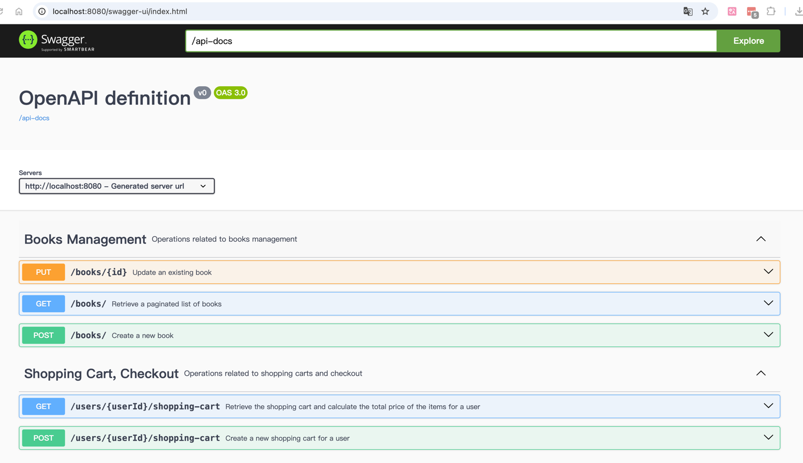

# Bookstore API

This is a RESTful API for managing books, shopping carts and checkout in a bookstore application. It allows users to create, update, and retrieve books and shopping cart details and calculate the total price of the items.

## Design Decisions
- **Domain-Driven Design (DDD)**: The design follows DDD principles to ensure that the domain logic is the focus of the application. This helps in building a rich domain model that reflects the business requirements and facilitates better communication between technical and non-technical stakeholders.
- **Modular Architecture**: The application is structured with separate layers for controllers, services, and repositories, following best practices in software design to enhance maintainability and readability.
- **DTOs for Data Transfer**: Data Transfer Objects (DTOs) are used to encapsulate the data sent to and from the API, providing a clear contract and reducing the risk of exposing internal models.
- **H2 Database**: The H2 in-memory database is used for development and testing purposes, providing a lightweight option for data storage.
- **Persistence Layer with Spring Data JPA**: The persistence layer utilizes Spring Data JPA, but does not leverage one-to-many relationships or similar features. Instead, operations are performed on a single table basis to simplify data management and access.
- **Flyway for Migration Management**: Flyway is used for database migration management, providing a robust way to version control database schema changes and ensuring consistency across different environments.

## Testing Strategy
- **API Layer**: Integration tests for the API layer are performed using `MockMvc` to ensure the endpoints behave as expected.
- **Service Layer**: The service layer is tested using Mockito to mock the repository interactions, allowing for focused unit testing.
- **Repository Layer**: Integration tests for the repository layer are conducted using an H2 database to verify data access and persistence.
- **Domain Layer**: Unit tests for the domain layer are implemented using JUnit to ensure the core business logic functions correctly.

## How to set up
1. **Prerequisites:**
    - Ensure you have [Java JDK 23](https://jdk.java.net/23/) installed.
    - Install [Gradle](https://gradle.org/install/) for dependence management.

2. **Clone the Repository:**
   ```bash
   git clone https://github.com/qicaisheng/bookstore
   cd bookstore
   ```

3. **Build the Project:**
    ```bash
    ./gradlew build
    ```
4. **Run the Application:**
    ```bash
    ./gradlew bootRun
    ```

5. **Access the API Documentation:** Open your web browser and navigate to http://localhost:8080/swagger-ui/index.html to explore the API endpoints.

## How to test
To execute the tests, run the following command in the root directory of the project:
   ```bash
   ./gradlew test
   ```

This command will execute all unit and integration tests defined in the project, and you can view the test results in the console output.

